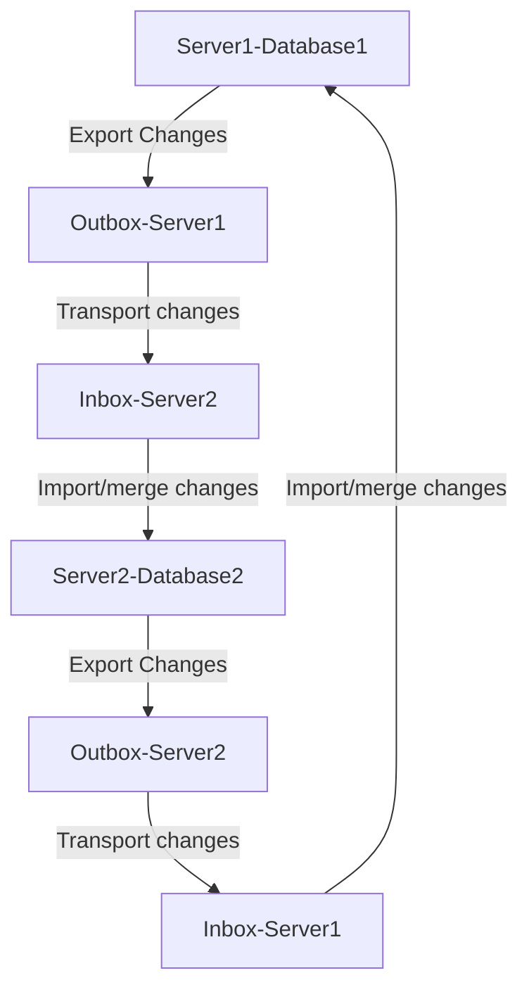

# synchronize-data
 Synchronize data across multiple database types  

Problem: An application uses multiple brands of databases on various hardware sizes and operating systems. It needs to synchronize data for every insert, update, and delete between the databases. This data synchronization need can be at attribute value level.  

Solution: To achieve database synchronization, consider various technologies such as application API, database triggers, querying, ODBC/JDBC, and database-specific replication. There are three basic steps: 1. Change capture at attribute / column value level  2. Transport changes to target servers/databases 3. Import / merge change at target servers / databases.  

DataJoin.net provides in-depth education and consulting on database synchronization.  

## Flowchart  Data synchronization  

Export change - can be done using API or database triggers.  
Tranport changes - can be done using odbc/jdbc or queueing (kafka, etc.)
Import changes - can be done using any programming language.

# Synchronization Code  
dj6_feature_2:components:code
Testapp1 and testapp2 are in PostgreSQL databases. These two databases can be in different database brands such as SQLite or SQL Server or others. 
User table create and data insert part of the script. You may create database depending upon the database brand.  For simplification, a table name sales_order is used for synchronization. 
Follow the steps below to test the synchronization between two applications testapp1 and testapp2.

# Set up two databases with two test apps.  
dj6_feature_2:components:code:setuptwoapps
After the steps below are the examples of objects named in the steps such as sales_order, etc.

Setup testapp1
Step 1: create testapp1 database (use admin UI)
Step 2: create sales_order table (CREATE TABLE sales_order.sql)
Step 3: create view name view_recordlevel_update_datetime (ds_create_view_recordlevel_update_datetime.sql)
Step 4: create ds_program_parameter table (CREATE TABLE  ds_program_para.sql)

Setup testapp2
Step 5: create testapp2 database (use admin UI)
Step 6: create sales_order table (do not enter rows in this table. Let the synchronization bring the data from testapp1
Step 7: create view name view_recordlevel_update_datetime  (ds_create_view_recordlevel_update_datetime.sql)

# Data operations for synchronization test  
dj6_feature_2:components:code:test  
(ds_test_insert_update_delete__from_testapp1_to_testapp2.sql)  

“insert” data operation synchronization test steps  
Step 1: insert one row in sales order_table
Step 2: insert Step1 data operation row in ds_outbox table
Step 3: run transport program between testapp1 and testapp2. This will transport  insert operation row from outbox of testapp1 to inbox of testapp2. (program id=1000 for ds_change_transport.py)
Step 4: run import program for testapp2. (program id=1001 for ds_change_import.py). This will import a new row in sales_order table. The same row that was in testapp1.
Step 5: check that there is row in testapp2 database in sales_order table using SELECT * from sales_order;

“update” data operation synchronization test steps  
Step 1: update a value in a column in sales_order_table
Step 2: insert Step1 data operation row in ds_outbox table
Step 3: run transport program between testapp1 and testapp2. This will transport  update operation row from outbox of testapp1 to inbox of testapp2. (program id=1000 for ds_change_transport.py)
Step 4: run import program for testapp2. (program id=1001 for ds_change_import.py). This will update the same column value in sales_order table.
Step 5: check that there is row in testapp2 database in sales_order table using SELECT * from sales_order;

“delete” data operation synchronization test steps  
Step 1: delete a row in sales order_table
Step 2: insert Step1 data operation row in ds_outbox table
Step 3: run transport program between testapp1 and testapp2. This will transport  update operation row from outbox of testapp1 to inbox of testapp2. (program id=1000 for ds_change_transport.py)
Step 4: run import program for testapp2. (program id=1001 for ds_change_import.py). This will delete the same row in sales_order table.
Step 5: check that there is row in testapp2 database in sales_order table using SELECT * from sales_order;

Two programs, ds_change_transport.py and ds_change_import.py can be in recurring running mode at specified interval. 

Table: sales_order  

Data operation 1 : insert row in sales_order  
--insert in sales_order table
INSERT INTO public.sales_order(
	order_id, order_type, description, product_type_name, customer_id, quantity, order_date, update_datetime, updated_by_user, updated_by_server)
	VALUES ('ord2','wholesale','old order','desktop','c1','100','5/25/2025','06/25/2025  10:30:00 AM','mtp','server1');

Data operation 2: update one column in sales_order  
--update description column in sales_order table
UPDATE sales_order set description='old order change1' where order_id='ord2'

Data operation 3: delete row in sales_order  
--delete record in sales_order
delete from sales_order where order_id='ord2'

The above operations are used for synchronization. The following changes are occurring in table name sales_order. These changes are put in ds_change_outbox by inserting rows in that table with the following in column name object_operation_command, type of change (U for update, I for insert, and D for delete) is in object_operation column. The object_operation_command is altered to make sure single quote isreplaced with ~ (another way is to use escape character).  Application API would have to do the same “insert” in the “outbox”.   

After each of the following changes, run transport change program between testapp1 and testapp2.  

“insert” data operation row in ds_change_outbox  
INSERT INTO public.ds_change_outbox(
	object_database, object_table, object_pk_attribute, object_attribute, object_id, object_value, object_operation, object_operation_command, updated_by_server_id, update_datetime, updated_by_user_id, object_id_old, object_value_old, note1)
	VALUES ('testapp1', 'sales_order', 'order_id', 'description', 'ord2', 'old order', 'I', 'INSERT INTO public.sales_order(order_id, order_type, description, product_type_name, customer_id, quantity, order_date, update_datetime, updated_by_user, updated_by_server) VALUES (~ord2~,~wholesale~,~old order~,~desktop~,~c1~,~100~,~5/25/2025~,~06/25/2025  10:30:00 AM~,~mtp~,~server1~);', 'server1', '06/25/2025  10:30:00 AM', 'mtp', 'tbd', 'tbd', 'tbd');

“update” data operation row in ds_change_outbox  
INSERT INTO public.ds_change_outbox(
	object_database, object_table, object_pk_attribute, object_attribute, object_id, object_value, object_operation, object_operation_command, updated_by_server_id, update_datetime, updated_by_user_id, object_id_old, object_value_old, note1)
	VALUES ('testapp1', 'sales_order', 'order_id', 'description', 'ord2', 'old order', 'U', 'UPDATE sales_order set description=~old order change~ where order_id=~ord2~', 'server1', '06/25/2025  10:30:00 AM', 'mtp', 'tbd', 'tbd', 'tbd');

“delete” data operation row in ds_change_outbox  
INSERT INTO public.ds_change_outbox(
	object_database, object_table, object_pk_attribute, object_attribute, object_id, object_value, object_operation, object_operation_command, updated_by_server_id, update_datetime, updated_by_user_id, object_id_old, object_value_old, note1)
	VALUES ('testapp1', 'sales_order', 'order_id', 'description', 'ord2', 'old order', 'D', 'delete from sales_order where order_id=~ord2~', 'server1', '06/25/2025  10:30:00 AM', 'mtp', 'tbd', 'tbd', 'tbd');

Table: Ds_program_parameter  

Flow chart: How changes from testapp1 and testapp2 are synchronized  
dj6_feature_2:components:code:flowchart  
 
# ds_change_transport.py   
dj6_feature_2:components:code:ds_change_tranport.py
This is simply moving data from outbox of testapp1 to inbox of testapp2
Block 0:  read ds_program_parameter table for specific  id for last pointer of testapp1 outbox and destination testapp2 info.
BLOCK A: Define database connection based on source and destination (testapp1 and testapp2)
BLOCK B: read the last or maximum id number from ds_change_outbox table
BLOCK C: Retrieve data between last point and maximum pointer from ds_change_outbox and writing data to ds_change_inbox of testapp2.
BLOCK D: updating program parameter with status and latest pointers

# ds_import_changes.py  
dj6_feature_2:components:code:ds_change_import.py
This is simply moving data from inbox of testapp2  to testapp2 app tables
Block 0: read ds_program_parameter table for specific  id for last pointer of testapp2 inbox and destination testapp2 info.
BLOCK A: Define database connection (testapp2)
BLOCK B: read the last or maximum id number from ds_change_inbox table
BLOCK C: Retrieve data between last point and maximum pointer from ds_change_inbox and perform data operations (insert, update, delete)  in testapp2 tables.
BLOCK D: updating program parameter with status and latest pointers

