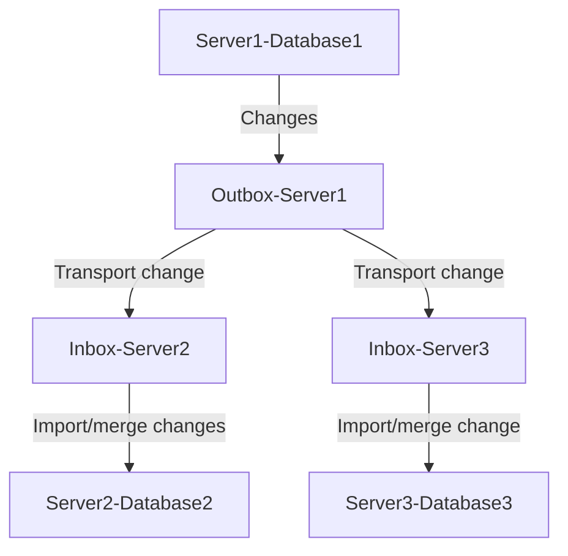

# synchronize-data
 Synchronize data across multiple database types  

Problem: An application uses multiple brands of databases on various hardware sizes and operating systems. It needs to synchronize data for every insert, update, and delete between the databases. This data synchronization need can be at attribute value level.  

Solution: To achieve database synchronization, consider various technologies such as application API, database triggers, querying, ODBC/JDBC, and database-specific replication. There are three basic steps: 1. Change capture at attribute / column value level  2. Transport changes to target servers/databases 3. Import / merge change at target servers / databases.  

DataJoin.net provides in-depth education and consulting on database synchronization.  

## Flowchart  Data synchronization  

